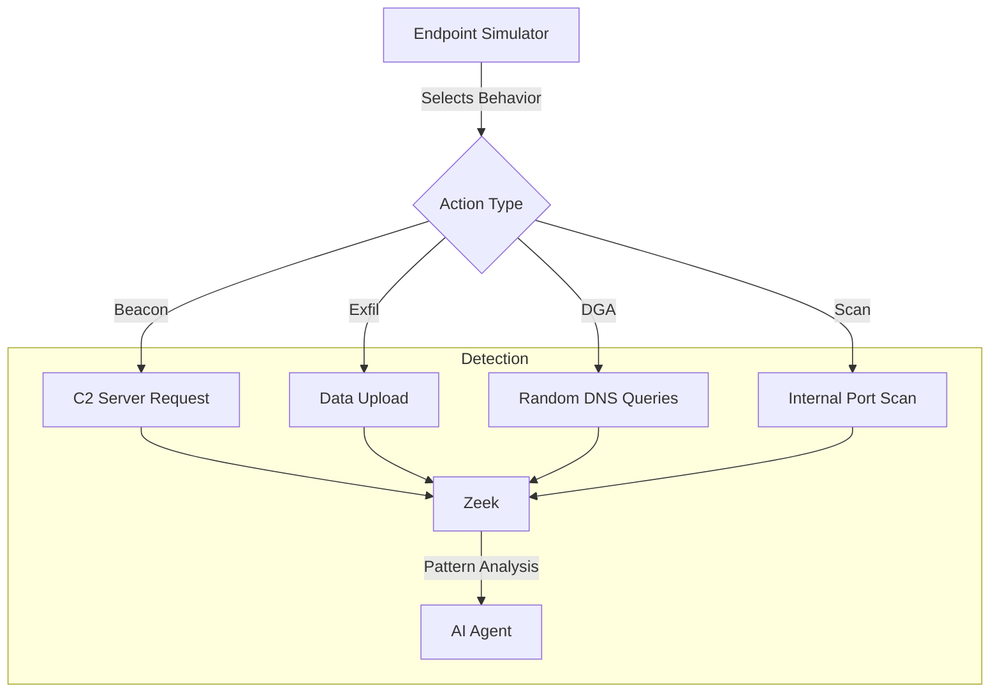

# 🎭 Endpoint Behavior Simulator

Simulates a sophisticated compromised endpoint exhibiting multiple malicious behaviors without necessarily uploading malware files. This tests behavioral analysis capabilities.

---

## ⚙️ **Technical Details**

- **IP Address:** `192.168.6.201`
- **Engine:** Python `endpoint_behavior_simulator.py`
- **Behaviors Simulated:**
  1. **C2 Beaconing:** Regular "heartbeat" calls to external servers.
  2. **Data Exfiltration:** Large POST requests (simulating stolen data).
  3. **DGA (Domain Generation Algorithm):** Random DNS queries.
  4. **Port Scanning:** Probing internal IP addresses.
  5. **Credential Harvesting:** Accessing sensitive paths (`/etc/passwd`).

---

## 🔄 **Simulation Flow**



---

## 🚀 **Usage**

### **Start Simulation**
```bash
./START.bat
```

### **Stop Simulation**
```bash
./STOP.bat
```

### **View Logs**
```bash
./LOGS.bat
```
