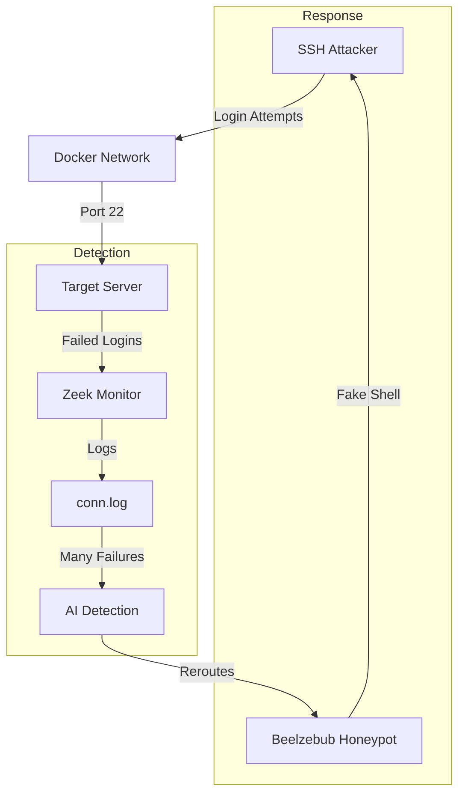

# 🔐 SSH Brute Force Attacker

Simulates an attacker attempting to guess SSH credentials to gain unauthorized access.

---

## ⚙️ **Technical Details**

- **IP Address:** `192.168.6.133`
- **Tool Used:** `hydra` or custom Python script
- **Wordlist:** Common passwords (admin, password, 123456, etc.)
- **Target:** `192.168.6.131:22` (Monitor) or `172.18.0.2:22` (Honeypot)

---

## 🔄 **Attack Flow**



---

## 🚀 **Usage**

### **Start Attack**
```bash
./START_SSH_ATTACKER.bat
```

### **Stop Attack**
```bash
./STOP_SSH_ATTACKER.bat
```

### **View Logs**
```bash
./VIEW_LOGS.bat
```
