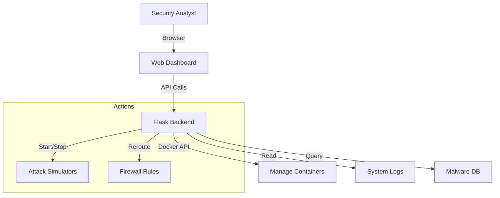

# 📊 Security Dashboard

The central control interface for the Network Security System. Provides real-time visualization, control over simulators, and threat intelligence reporting.

---

## ⚙️ **Technical Stack**

- **Backend:** Python Flask
- **Frontend:** HTML5, CSS3, JavaScript (ES6)
- **Communication:** REST API
- **Port:** `5000` (Internal), `5001` (External Access)

---

## 🖥️ **Interface Overview**

| Page | Function |
|------|----------|
| **Overview** | System health, container status, recent alerts. |
| **Network Map** | Visual topology of all connected devices and attackers. |
| **Monitor** | Zeek status and raw log viewer. |
| **Honeypot** | Interaction logs, LLM responses, and rerouting controls. |
| **Attackers** | Start/Stop controls for all attack simulators. |
| **AI Agent** | Chat interface to query the security agent. |

---

## 🔄 **Data Flow**



---

## 🚀 **Usage**

### **Start Dashboard**
```bash
./start_dashboard.bat
```
*Access at http://localhost:5000*

### **Restart Dashboard**
```bash
./restart_dashboard.bat
```
