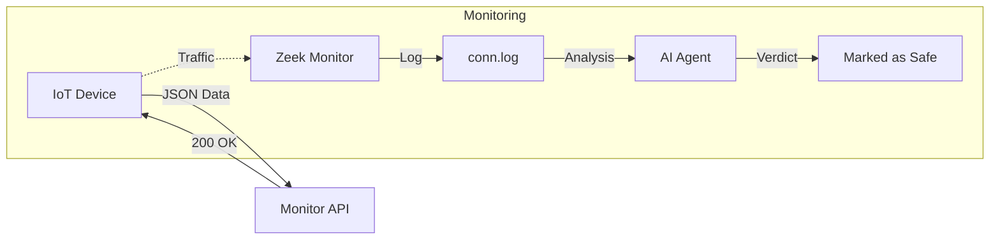

# 📱 IoT Device Simulators

Simulates legitimate IoT devices on the network to provide baseline "normal" traffic. This helps test the system's ability to distinguish between benign and malicious activity.

---

## ⚙️ **Technical Details**

- **Base Image:** Python 3.9 Slim
- **Network:** `custom_net` (192.168.6.0/24)
- **IP Range:** `192.168.6.10` - `192.168.6.50`
- **Behavior:** Sends JSON sensor data (temperature, humidity) every 10 seconds.

---

## 🔄 **Traffic Flow**



---

## 🚀 **Usage**

### **Create Devices**
```bash
# Create 5 devices
./manage_devices.bat create 5 iot_sensor
```

### **Remove Devices**
```bash
# Remove all devices
./manage_devices.bat remove
```

### **Check Status**
```bash
docker ps --filter "name=device_"
```
