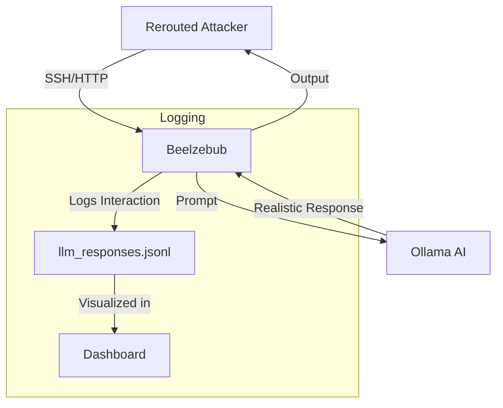

# 🍯 Beelzebub Honeypot (AI-Powered)

A high-interaction honeypot designed to trap attackers and engage them using Generative AI (LLM). It simulates a vulnerable Linux server and dynamically generates responses to attacker commands.

---

## ⚙️ **Technical Details**

- **Core Engine:** [Beelzebub](https://github.com/mariocandela/beelzebub)
- **AI Engine:** Ollama (Llama 3.1)
- **Network:** `honeypot_net` (172.18.0.0/16)
- **IP Address:** `172.18.0.2`
- **Services Emulated:** SSH, HTTP, FTP, MySQL, PostgreSQL

---

## 🧠 **AI Integration**

Unlike traditional honeypots with static responses, this system uses an LLM to:
1. **Understand Context:** Analyzes the attacker's command history.
2. **Generate Output:** Creates realistic file contents, command outputs, and error messages.
3. **Maintain Deception:** Adapts to the attacker's skill level.

---

## 🔄 **Interaction Flow**



---

## 🚀 **Usage**

### **Start Honeypot**
```bash
./START.bat
```

### **View Live Logs**
```bash
./VIEW_LOGS.bat
```

### **View LLM Interactions**
```bash
./VIEW_LLM_LOGS.bat
```
