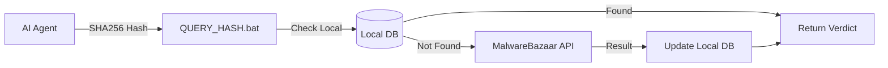

# 🗄️ Malware Database & YARA Rules

A local threat intelligence database used by the AI Agent to verify file hashes and identify malicious patterns.

---

## ⚙️ **Components**

1.  **Hash Database:** A local cache of known malware hashes (SHA256).
2.  **MalwareBazaar API:** Integration for real-time hash lookups.
3.  **YARA Rules:** Pattern matching rules for identifying malware families.

---

## 🔄 **Lookup Process**



---

## 🚀 **Usage**

### **Check a Hash**
```bash
./CHECK_HASH.bat <SHA256_HASH>
```

### **Update Database**
```bash
./UPDATE_MALWAREBAZAAR.bat
```

### **Verify Integrity**
```bash
./VERIFY_DATABASE.bat
```
