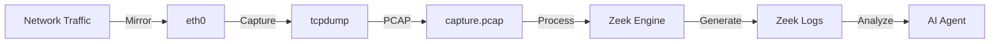

# 🌐 Network Monitor (Zeek)

The core monitoring infrastructure. A Docker container running Zeek and tcpdump to capture and analyze all network traffic in real-time.

---

## ⚙️ **Technical Details**

- **Container Name:** `network-monitor`
- **IP Address:** `192.168.6.131`
- **Tools:**
  - **Zeek:** Network Security Monitor (NSM)
  - **tcpdump:** Packet capture utility
  - **Flask:** API for receiving device data
- **Network:** `custom_net` (Promiscuous mode enabled)

---

## 📊 **Log Files**

Logs are stored in `zeek_logs/session_TIMESTAMP/`:

| Log File | Description |
|----------|-------------|
| `conn.log` | Summary of all TCP/UDP connections (IPs, ports, duration). |
| `files.log` | Details of file transfers (hashes, MIME types). |
| `http.log` | HTTP requests (methods, URIs, user-agents). |
| `dns.log` | DNS queries and responses. |

---

## 🔄 **Capture Pipeline**



---

## 🚀 **Usage**

### **Start Monitor**
```bash
./START.bat
```

### **Access Logs**
Logs are automatically rotated every 30 seconds and saved to the `zeek_logs` directory.
